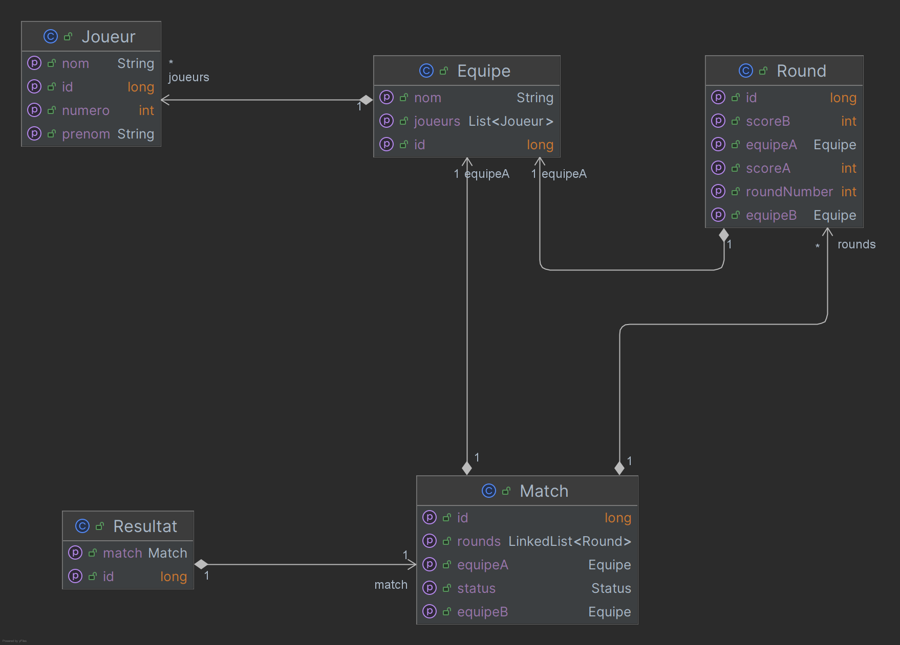
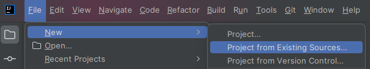
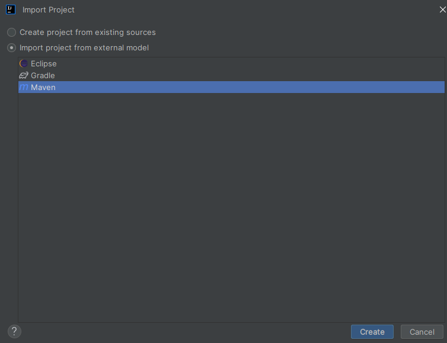
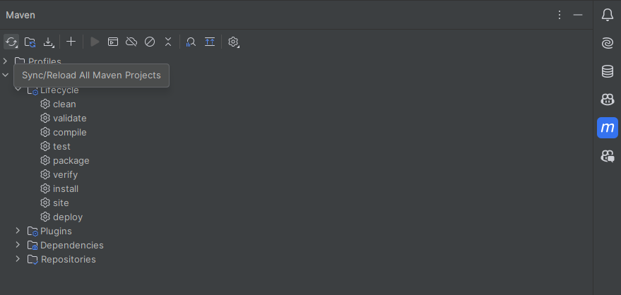
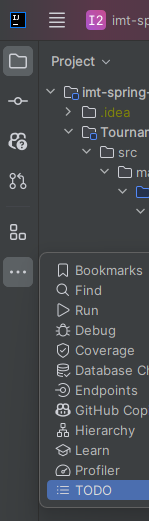
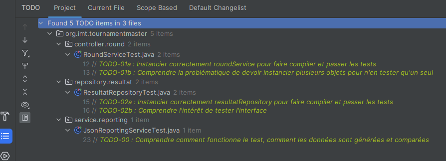

# TP Spring boot - JPA - Hibernate

## Objectif

L'objectif de ce TP est de progressivement mettre en place une application Spring boot qui utilise JPA pour gérer des données depuis une base de données.

C'est l'occasion de parler des concepts suivants : 

- Injection de dépendances
- Configuration
- Exposer une API REST
- JPA
- Transactions
- Tests
- AOP (Aspect Oriented Programming)
- Sécurité

## Prérequis

- Java 21
- Avoir docker et docker compose installé sur sa machine
- Un IDE (IntelliJ fortement recommandé)

## Présentation fonctionnelle du projet

Le projet est une application de gestion des scores d'un match [d'un sport non imposé, faites-vous plaisir]. 
Pour l'instant elle ne permet que de consulter via Java des scores pré-définis (qu'on appelle aussi "bouchonnés", "mocked" en anglais), mais l'objectif est de pouvoir ajouter des scores, des matchs, des équipes, des joueurs, etc. et d'y accéder par API REST.

## Présentation technique du projet

Le projet initial, TournamentMaster3000, est un projet maven avec des sources java et des tests unitaires.

Le code est séparé en 4 packages principaux :

- controller : les classes qui exposent les API REST (pour l'instant, rien n'est exposé)
- model : les classes qui représentent le modèle de données de l'application
- repository : les classes qui permettent de manipuler la source des données [en base de données par exemple]
- service : les classes qui contiennent la logique métier de l'application et font le lien entre les controllers et les repositories

Le modèle de données est le suivant :




Note : L'appellation Round est utilisée au lieu de Set pour éviter les confusions avec la collection Set de Java.

Les fichiers de l'application sont répartis tels quel :

```
\ TournamentMaster3000
    \ src
        \ main
            \ java
                # Ici se trouvent les sources java
            \ resources
                # Ici se trouvent les ressources du projet (fichiers de configuration, etc.)
        \ test
            \ java
                # Ici se trouvent les tests unitaires
            \ resources
                # Ici se trouvent les ressources des tests unitaires (fichiers de configuration, etc.)
    pom.xml # Fichier de configuration maven qui décrit la structure du projets et ses dépendances
```
## Import du projet

Récupérer le projet :

```bash
git clone https://github.com/Nimedas/imt-spring-2024.git
```

Importer le projet dans IntelliJ :

- File > New > Project from existing sources
- Import project from external model > Maven





IntelliJ va importer le projet en lisant le pom.xml, télécharger les dépendances et indexer les fichiers.

Si besoin, faire un `mvn clean install` pour télécharger les dépendances OU rafraichir via le menu maven sur la droite de l'IDE :




**Pour l'instant, le projet ne compile pas donc la commande mvn finira en échec, c'est normal. Le but du premier TP est de le faire compiler pour que les tests passent.**

## Déroulé du TP

En partant de la branche main, il y a des TODO numérotés dans le code pour vous guider dans les étapes à suivre.

Pour les afficher tous dans un menu contextuel, il faut sur les pointillés en haut à gauche de l'IDE :



Puis y accéder en bas à gauche :




Pour vérifier votre travail ou en cas de blocage, les solutions sont disponibles dans les branches numérotées avec les TODOs du TP suivant.

## Quelques commandes git utiles

Quelques commandes git peuvent être utiles pour ces TPs : 

Pour afficher la liste des branches : 

```bash
git branch
```

Pour changer de branche si vous n'avez aucun changement en cours :

```bash
git checkout nom_de_la_branche
```

Pour sauvegarder vos changements en cours sur la branche actuelle :

```bash
git commit -am "Message de commit"
```

Pour nettoyer votre espace de travail (en gardant ce que vous avez déjà commit) :

```bash
git clean -df
```

Pour réinitialiser votre espace de travail à l'état de la branche actuelle :

```bash
git reset --hard
```

Pour aller plus loin, un exemple de documentation avec des explications : https://education.github.com/git-cheat-sheet-education.pdf

Pour aller encore plus loin : https://ndpsoftware.com/git-cheatsheet.html